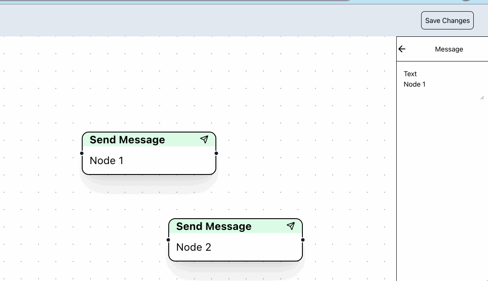
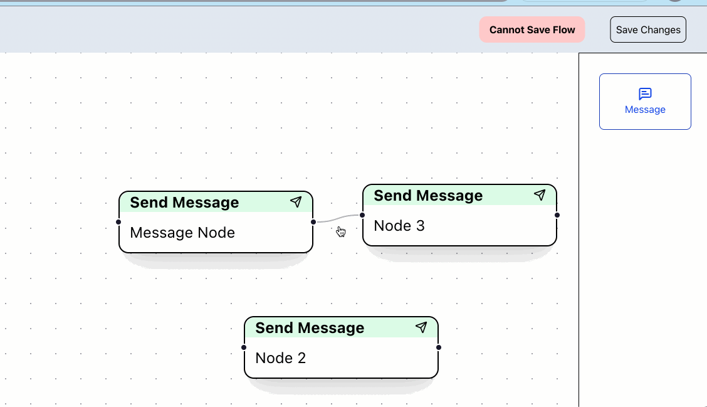

This is a Frontend Hiring Task for Bitespeed.
- The task is to implement a basic chat flow builder.
- The tech stack here is NextJs and an external library called [reactflow](https://www.reactflow.dev).
- The flow has message nodes that can be dropped in from a side bar.
- Upon clicking a node, the side bar view changes to a text area where the label of the node can be edited.
- The flow cannot be saved with more than one nodes having empty target handles.
- The task is deployed [here]().

## Installation Guide

Run the following command to install the dependencies
```bash 
npm install
```
## Running the development server

Run the development server with the following:

```bash
npm run dev
```
Open [http://localhost:3000](http://localhost:3000) with your browser to see the result.

### Demos

Changing Node Label and adding new node


Saving the flow

